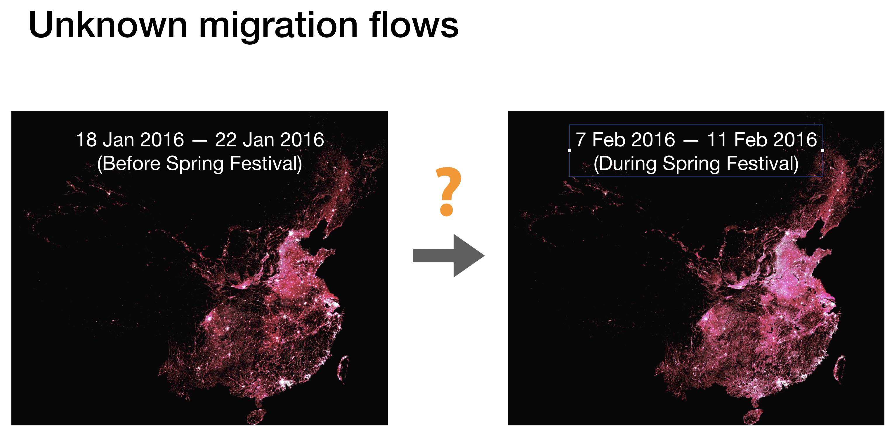
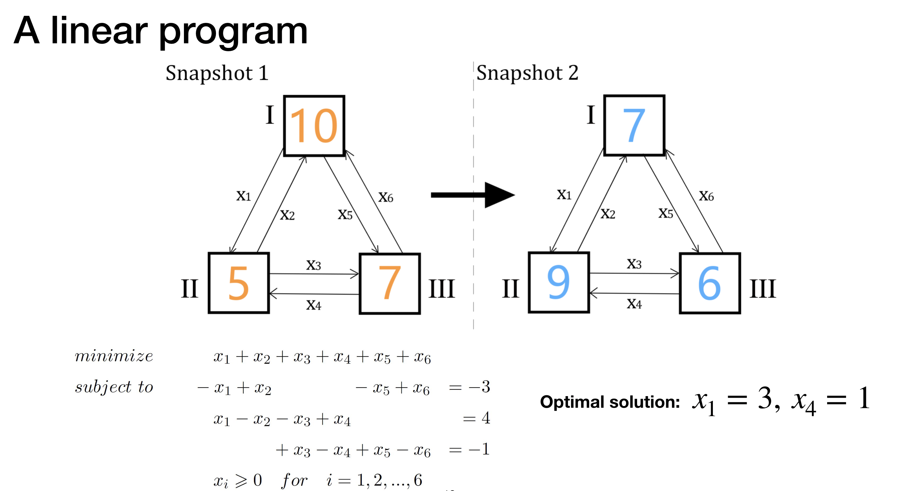
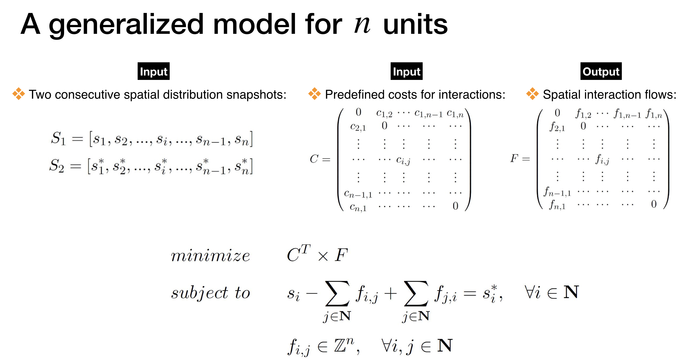
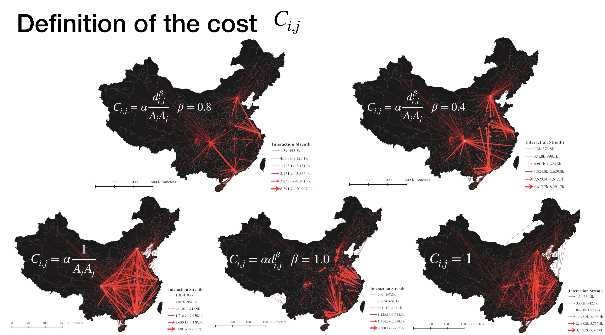

# IIDS -Inferring_Interactions_from_Distribution_Snapshots
A Linear programming solution to Infer the unknown spatial flows from spatial distribution snapshots

 ---- 

Opensource code for the journal paper Di Zhu, Zhou Huang, Li Shi, Lun Wu &amp; Yu Liu (2018) Inferring spatial interaction patterns from sequential snapshots of spatial distributions, International Journal of Geographical Information Science, 32:4, 783-805, DOI: 10.1080/13658816.2017.1413192

----











## Citation
Please cite our paper if IIDS helps you in your own work:

hu, D., Huang, Z., Shi, L., Wu, L., & Liu, Y. (2018). Inferring spatial interaction patterns from sequential snapshots of spatial distributions. *International Journal of Geographical Information Science*, 32(4), 783-805.

```
@article{zhu2018inferring,
title={Inferring spatial interaction patterns from sequential snapshots of spatial distributions},
author={Zhu, Di and Huang, Zhou and Shi, Li and Wu, Lun and Liu, Yu},
journal={International Journal of Geographical Information Science},
volume={32},
number={4},
pages={783--805},
year={2018}}
```